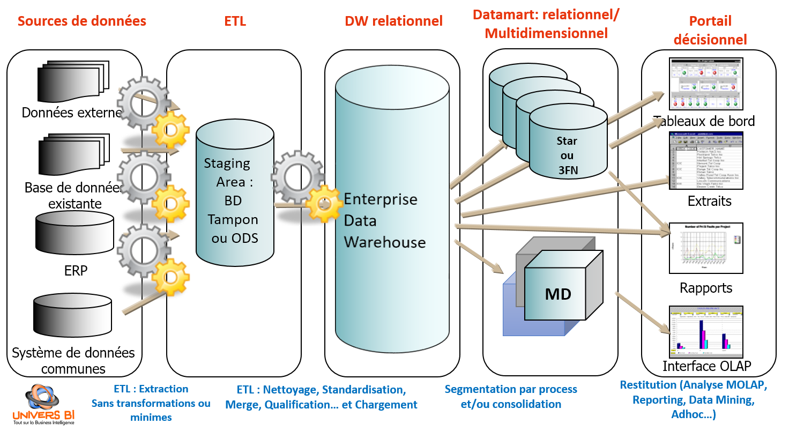

# 🚀 Football Management Project

## 📋 Table des Matières
- [Aperçu](#aperçu)
- [Objectifs](#objectifs)
- [Structure du Projet](#structure-du-projet)
- [Technologies](#technologies)
- [Fonctionnalités](#fonctionnalités)
- [Architecture](#architecture)
- [Prérequis](#prérequis)
- [Démonstration](#démonstration)

## 📋Aperçu
Ce projet utilise les technologies Power BI, Talend, Python et Angular pour créer une solution complète de Business Intelligence permettant d'analyser, visualiser et interagir avec les données pour gérer les équipes de football.

## 🎯Objectifs
- Optimiser la gestion des équipes et des joueurs.
- Analyser les performances des équipes et Joueurs pour des prises de décision stratégiques.

## 🏗Structure du Projet
Voici la structure principale du projet :

- **PIBackFinal** : Contient les fichiers backend pour la gestion des données et l'intégration avec Power BI.
- **ProjetGarkFinalIV** : Répertoire lié au frontend, développé probablement en Angular, pour une interface utilisateur intuitive.
- **VideoPrediction** : Modules et scripts dédiés aux prédictions vidéo basées sur des modèles d'apprentissage machine ou de deep learning.
- **API Formation.py** : Script Python pour configurer ou gérer une API utilisée dans le projet.
- **Pi Final.pbix** : Rapport Power BI qui fournit des analyses visuelles des données liées aux équipes ou au personnel.

## 🏗Architecture

    
## 🛠Technologies
- **Power BI** : Pour la création de rapports et tableaux de bord dynamiques.
- **Talend** : Pour l'intégration et la transformation des données via des pipelines ETL.
- **Python** : Pour les scripts personnalisés et le traitement avancé des données.
- **Angular** : Pour développer une interface utilisateur intuitive.
- **PostgreSQL** : Gestion de la base de données relationnelle pour stocker et interroger les données.

## 📊Fonctionnalités
1. **Gestion des données** : Utilisation de Talend pour intégrer et transformer les données.
2. **Analyses visuelles** : Rapports Power BI pour visualiser les performances des équipes et des joueurs.
3. **Prédictions vidéo** : Analyse et détection d'événements à partir de séquences vidéo.
4. **API personnalisée** : Interface pour intégrer des données externes ou communiquer avec d'autres services.

## ⚙Prérequis
- Avoir Power BI Desktop installé.
- Talend Studio (dernière version).
- Python 3.2+ avec `pip` installé.
- Node.js et Angular CLI.
- PostgreSQL 14+ installé et configuré.

## 📺Démonstration

